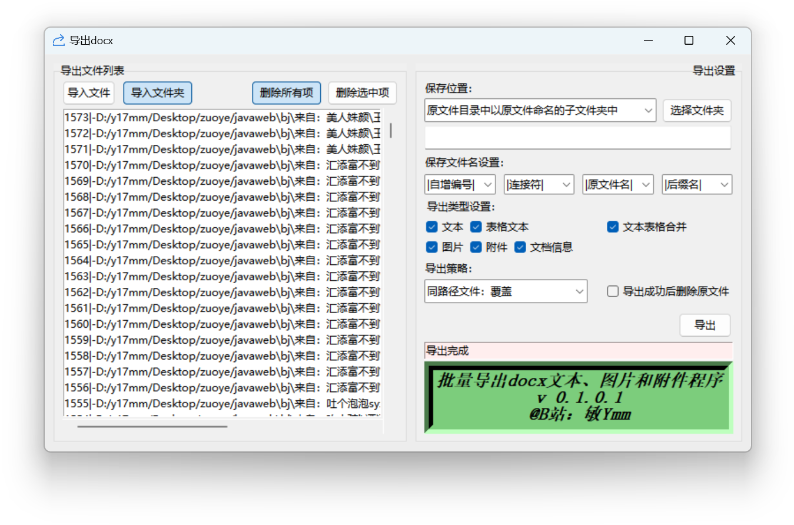
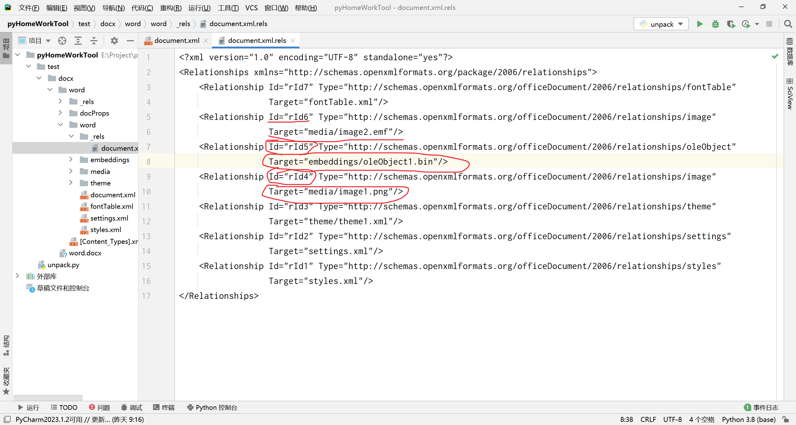

# python_docx_export
使用Python导出docx文档中的图片、文本和附件：Export images, text, and attachments in docx documents using Python.


# 【Python】导出docx格式Word文档中的文本、图片和附件等

## 零、需求

为批量批改学生在机房提交的实验报告，我需要对所有的实验文档内容进行处理。需要批量提取Word文档中的图片和附件以便进一步检查。如何提取？我想到了用起来比较方便的Python，经过试验，方案可行，故此记录。学生的作业主要是docx或者doc文档，学生把项目打成压缩包后以文件附件的形式放到文档中，另外附上项目运行截图以方便批阅检查。我教的这门课有5个班，179人，总共两千多份作业。
 ╮(╯▽╰)╭

## 壹、软件

最终我使用Python的tkinter构建了一个图形界面的小工具（链接在末尾），能导出docx文档的相关内容，主界面如下：



界面左右分栏，左边是待导出的docx文件列表，右边是一些导出选项。配置好之后点击“导出”按钮开始导出相关内容，导出界面如下：


导出成功后可以保存一份json格式的导出报告，这份报告中记录了导出的文件和原始文件的关系，导出报告界面如下：


功能就这样了，简简单单，剩下的识别作业，自动批改作业的代码还没整理，拿不出手，哈哈（>__<）。

## 贰、方案

**下面介绍软件细节相关内容和部分探索的过程：**


使用Python处理Word文档，经过搜索，发现有如下几个主流方案：

1. python-docx：python-docx是一个用于创建和更新Word（.docx）文件的python库，目前只支持docx。
2. pywin32：能处理doc和docx文档，但是只能在Windows平台上用，而且使用的时候需要电脑有安装Office或者WPS。
3. python-docxtpl：使用Word文件模板生成新的Word文档，这个好像跟主题无关，但是感觉水文档啥的很有用，故写一下。

经过考虑，确认使用python-docx，不需要另外安装Office和WPS就能独立处理Word文档，支持跨平台。至于有学生提交doc文档？拒收！（我给他们的是docx文档，应该不会故意转成doc提交的，实在不行到时候再写个插件用pywin32把doc转成docx再处理吧~ QWQ）
另外，还需要用到python-oletools这个库，配合python-docx可以用来导出嵌入的附件。

## 叁、实现

### 1. 要处理的Word文档
要处理的Word文档大致如下图所示：
(o゜▽゜)o☆

在Word文档中插入了一段文字、一张图片和一个作为附件的压缩包，附件是以“文件附件”的形式嵌入到文档中的（即打包到了文档中，换台电脑也能正常打开)，这样可以模拟学生提交的实验报告文档的大致情况。

### 2. Word文档的结构
经过简单的尝试，发现docx是一个压缩包，可以直接用7z打开：
(๑ˉ∀ˉ๑)

于是将其解包，得到如下目录：

```cmd
Microsoft Windows [版本 10.0.22621.1702]
(c) Microsoft Corporation。保留所有权利。

E:\Project\pythonProject\pyHomeWorkTool\test\docx\word>tree /f
卷 卷下落花随流水 的文件夹 PATH 列表
卷序列号为 EA73-5C63
E:.
│  [Content_Types].xml
│
├─docProps
│      app.xml
│      core.xml
│      custom.xml
│
├─word
│  │  document.xml
│  │  fontTable.xml
│  │  settings.xml
│  │  styles.xml
│  │
│  ├─embeddings
│  │      oleObject1.bin
│  │
│  ├─media
│  │      image1.png
│  │      image2.emf
│  │
│  ├─theme
│  │      theme1.xml
│  │
│  └─_rels
│          document.xml.rels
│
└─_rels
        .rels


E:\Project\pythonProject\pyHomeWorkTool\test\docx\word>
```
简单分析，我们发现`/word/media/image1.png`就是刚刚插入的图片，再编辑文档再插入，发现也还是放到这个文件夹中的。基本可以确定以后Word中的所有图片都可以到这里解压出来。

另外我们发现`/word/embeddings/oleObject1.bin`文件能用7z打开，也是压缩格式，里面的`[1]Ole10Native`应该是刚刚放入的压缩文件，至少能得到压缩包里的文件，但是附件的原文件名就不知道在哪拿了。经过上网搜索，发现这是一种OLE文件，doc文档也是这种格式的文件，恰好Python有个叫*python-oletools*的库可以把嵌入的文件从ole文件中转存出来。

同时我们用WinHex查看`/word/embeddings/oleObject1.bin中的[1]Ole10Native`，可以发现前面的这一些数据刚好是文件名。因为我们插入的是压缩文档，所以不太好分析原始文档的数据范围，不过用7z打开能直接看到原始压缩文档的目录，说明并没有对插入文档进行再一步的封装，很可能只是加了点头和尾啥的。我们把插入的文档从压缩文档换成文本文档应该就更好分析了，这边不另外截图了，大致分析过程是一样的。这样我们可以发现`[1]Ole10Native`只是在原文档的基础上在文件头和文件尾添加了一些文件名、原始路径和缓存路径等，应该是有固定格式的。我们待会儿应该是可以把这些内容提取出来的。其中的路径可以作为判断学生作业其他的依据。
(￣︶￣)↗

除了上面两个文档，我还发现`/word/_rels/document.xml.rels`中保存了一份文件清单，这份文件清单有我们嵌入的压缩文档（Id=rId5）和插入的图片（Id=rId4），看了下rId6指向的`/word/media/image2.emf`，这个是我们嵌入的附件图标图片。

为啥这里强调它们的ID，一个原因是这里的ID是除了路径外的另外一个文件识别标记，另一个原因是我在另外一个文档（`/word/document.xml`）中发现了它们：

这个文档看起来是一整个Word文档的核心，Word上的所有内容应该都可以在这个上面找到所对应的地方，例如我图中的用红色笔圈起的部分对应着Word中的可见文字，用橙色笔圈起的部分对应着Word中的图片，用粉色笔圈起的部分对应着Word中的附件（OLE)。最重要的是用紫色笔圈起的部分的ID，这部分与`/word/_rels/document.xml.rels`中的ID对应，这样我们把这两份文档关联起来就能找到与文档中插入部分对应的文件了！

另外的一些xml中还发现了一些另外的有趣属性，这些又可以作为判断学生作业的其他依据：
(～￣▽￣)～

### 3. 实现目标
了解了docx文档的大致结构后，我们可以开始尝试使用python-docx去获取上面的一些数据了。大致需要实现如下功能：
1. 所有文字转存为文本文件。
2. 所有图片转存为单独的图片文件，具体的格式为Word能插入的图片格式。
3. 所有插入的附件转存为原始文档，并尝试恢复原文件名（图片应该也有原文件名的，应该在`/word/document.xml`中，但是没必要，因为很多同学是截图插入的，没有保存成文件。文档的原文件名可以帮助判断这个附件是干啥的，比如sql文档和txt文档都是文本文档，存储方式一样，只是文件名不一样，如果有文件名我可以快速初步判断这个是不是sql文档）。

### 4. 使用python-docx打开Word文档
导入python-docx：
```py
import docx
```
python-docx使用起来非常简单，用以下语句就可以打开word文档了：
```py
# 文件路径
docx_file = r"E:\Project\pythonProject\pyHomeWorkTool\test\docx\word.docx"
# 打开docx文档
docx_document = docx.Document(docx_file)
```
### 5. 提取文本
使用PyCharm的代码调试工具，可以对`docx_document `进行简单的分析：

可以发现文档的大部分文本在paragraphs对象中，这是一个列表，我们待会儿可以循环获取其text值，拼接起来导出即可。代码表示如下：
```py
all_text = ''
for paragraph in docx_document.paragraphs:
    all_text += paragraph.text
print('所有文本：', all_text)
```
对测试文档的运行结果如下：
```cmd
D:\ProgramData\Anaconda3\python.exe E:/Project/pythonProject/pyHomeWorkTool/unpack.py
打开文档完成
所有文本： 1文字：这是一段文字。翩若惊鸿，婉若游龙。荣曜秋菊，华茂春松。髣髴兮若轻云之蔽月，飘飖兮若流风之回雪。远而望之，皎若太阳升朝霞；迫而察之，灼若芙蕖出渌波。01234567892图片：3附件：

进程已结束，退出代码为 0
```
目前看就还好，文字都在，但是还不知道是不是全部文档，因为文档中还有表格、文本框等其他特殊一点的文本。重新修改文档，插入表格，发现插入的表格无法导出。故再次分析，发现表格也是在`docx_document `对象下的：

于是我们再导出表格：
```py
all_table_text = ''
for table in docx_document.tables:
    for cell in getattr(table, '_cells'):
        all_table_text += cell.text + ' '  # 单元格之间用空格隔开
print('所有表格文本：', all_table_text)
```
运行结果：
```cmd
D:\ProgramData\Anaconda3\python.exe E:/Project/pythonProject/pyHomeWorkTool/unpack.py
打开文档完成
所有文本： 1文字：这是一段文字。翩若惊鸿，婉若游龙。荣曜秋菊，华茂春松。髣髴兮若轻云之蔽月，飘飖兮若流风之回雪。远而望之，皎若太阳升朝霞；迫而察之，灼若芙蕖出渌波。01234567892图片：3附件：
所有表格文本： 姓名 班级 科目 分数 小明 2 Java 97 小红 2 C 78 

进程已结束，退出代码为 0
```
看起来不太理想，要想在文本文档中重建表格的话还得写更多判断的代码。不过这个满足我的需求了，我的实验文档中有个表格是填姓名的，提取出后可以根据这个判断是谁的实验文档（其实从文件名也可以判断）。

另外的文本框还暂时不知道怎么通过`docx_document `对象提取，不过既然有`/word/document.xml`文件，大不了直接解析xml了。
（＃￣～￣＃）
### 6. 提取图片和OLE嵌入对象
我们前面找到了图片的和OLE附件的文件清单（`/word/_rels/document.xml.rels`）、对应的文件和`/word/document.xml`文件，以及它们之间的关系。同样的，我们对`docx_document `对象分析：

我们可以发现，在`docx_document `对象下的`part`对象下的`related_parts`字典中有很多键为“rId**”的对象，而这些对象的键和路径（`partname`）刚刚好与我们刚刚所看的文件清单（`/word/_rels/document.xml.rels`)和`/word/document.xml`文件中的一致。由此我们可以大致确定这些对象就是指向哪些文件的对象。然后发现对象中有个`blob`字节数组，可以猜测这就是对应的文件数据，我们尝试把这些导出来看看能不能打开，代码如下：
```py
import os

# 文件导出列表
export_files = []
# 遍历所有附件
index = 0
docx_related_parts = docx_document.part.related_parts
for part in docx_related_parts:
    part = docx_related_parts[part]
    part_name = str(part.partname)  # 附件路径（partname）
    if part_name.startswith('/word/media/') or part_name.startswith('/word/embeddings/'):  # 只导出这两个目录下的
        # 构建导出路径
        index += 1
        save_dir = os.path.dirname(os.path.abspath(__file__))  # 获取当前py脚本路径
        index_str = str(index).rjust(2, '0')
        save_path = save_dir + '\\' + index_str + ' - ' + os.path.basename(part.partname)  # 拼接路径
        print('导出路径：', save_path)

        # 写入文件
        with open(save_path, 'wb') as f:
            f.write(part.blob)
        # 记录文件
        export_files.append(save_path)
print('导出的所有文件：', export_files)
```
输出结果：
```cmd
D:\ProgramData\Anaconda3\python.exe E:/Project/pythonProject/pyHomeWorkTool/unpack.py
打开文档完成
所有文本： 1文字：这是一段文字。翩若惊鸿，婉若游龙。荣曜秋菊，华茂春松。髣髴兮若轻云之蔽月，飘飖兮若流风之回雪。远而望之，皎若太阳升朝霞；迫而察之，灼若芙蕖出渌波。01234567892图片：3附件：
所有表格文本： 姓名 班级 科目 分数 小明 2 Java 97 小红 2 C 78 
导出路径： E:\Project\pythonProject\pyHomeWorkTool\01 - image2.emf
导出路径： E:\Project\pythonProject\pyHomeWorkTool\02 - oleObject1.bin
导出路径： E:\Project\pythonProject\pyHomeWorkTool\03 - image1.png
导出的所有文件： ['E:\\Project\\pythonProject\\pyHomeWorkTool\\01 - image2.emf', 'E:\\Project\\pythonProject\\pyHomeWorkTool\\02 - oleObject1.bin', 'E:\\Project\\pythonProject\\pyHomeWorkTool\\03 - image1.png']

进程已结束，退出代码为 0
```
还有三个文件：

成功！
(๑•̀ㅂ•́) ✧
尝试修改文件，插入更多的图片、附件，依然能导出。这样我们的图片和附件就导出了，那么还有最后一个问题，就是怎么把导出的OLE文件还原为原来的附件？
### 7. 从OLE嵌入对象中提取原始附件
最后一个问题，我们需要把OLE文件中的原始文件提取出来，前面进行过简单的分析，如果不借助第三方工具则可以自己使用zip压缩模块把文件提取出来，然后把其在文件头尾添加的原始文件名、原始路径和缓存路径等删除即可。这样的话我们得分析其的组成结构，比较麻烦。不过恰好我们在找资料的时候发现了一个Python库：python-oletools，看简介它是用来对恶意的OLE文件进行分析的，因为之前的Word文档是doc格式的嘛，然后doc格式本质就是一个OLE文件，文档中可以插入一些恶意的文件，因此需要有对应的扫描工具。这样它自然而然的就应该有提取OLE文件中的原始文件的能力。简单阅读其文档发现我们可以利用它的oleobj.py脚本对OLE文件进行提取：
直接到GitHub上下载好python-oletools项目的源码，同时它依赖另外一个项目“olefile”，也下载下来，我这边使用的分别是0.60.1和0.46的版本。根据其项目文档，我们下载好项目后可以直接使用命令行的方式使用它（如果提示找不到模块，要把olefile放到oletools中），例如，我们要提取刚刚从docx中导出的那个OLE附件包：
```cmd
Microsoft Windows [版本 10.0.22621.1702]
(c) Microsoft Corporation。保留所有权利。

C:\Users\y17mm>D:\ProgramData\Anaconda3\python.exe D:\y17mm\Downloads\oletools\oleobj.py "E:\Project\pythonProject\pyHomeWorkTool\02 - oleObject1.bin"
D:\y17mm\Downloads\oletools\oleobj.py:581: SyntaxWarning: "is" with a literal. Did you mean "=="?
  if idx is -1:
oleobj 0.60.1 - http://decalage.info/oletools
THIS IS WORK IN PROGRESS - Check updates regularly!
Please report any issue at https://github.com/decalage2/oletools/issues

-------------------------------------------------------------------------------
File: 'E:\\Project\\pythonProject\\pyHomeWorkTool\\02 - oleObject1.bin'
extract file embedded in OLE object from stream '\x01Ole10Native':
Parsing OLE Package
Filename = "Êڿμƻ®.rar"
Source path = "D:\y17mm\Desktop\zuoye\Êڿμƻ®.rar"
Temp path = "C:\Users\y17mm\AppData\Local\Temp\Êڿμƻ®.rar"
saving to file E:\Project\pythonProject\pyHomeWorkTool\02 - oleObject1.bin_________.rar

C:\Users\y17mm>
```
导出结果：

导出是导出了，但是好像不支持中文，用的应该不是GBK的解码方式。如果对这个不在意的话可以直接把下载下来的项目放到项目里，使用下面的代码就可以实现对OLE文件的自动提取了（如果提示找不到模块，olefile和oletoos应该并排放在项目中，或者直接使用pip安装两个库也可以)：
```py
from oletools import oleobj

for file in export_files:
    if file.endswith('.bin') and 'ole' in file.lower():  # .bin 作为后缀且文件名中有ole，则被认为是OLE文件
        res = oleobj.main([file])
        if res == 1:  # 1为成功提取
            os.remove(file) # 删除OLE文件，仅保留原始附件
        else:
            print(file, '提取OLE失败')
```
执行结果：
```cmd
D:\ProgramData\Anaconda3\python.exe E:/Project/pythonProject/pyHomeWorkTool/unpack.py
打开文档完成
所有文本： 1文字：这是一段文字。翩若惊鸿，婉若游龙。荣曜秋菊，华茂春松。髣髴兮若轻云之蔽月，飘飖兮若流风之回雪。远而望之，皎若太阳升朝霞；迫而察之，灼若芙蕖出渌波。01234567892图片：3附件：
所有表格文本： 姓名 班级 科目 分数 小明 2 Java 97 小红 2 C 78 
导出路径： E:\Project\pythonProject\pyHomeWorkTool\01 - image2.emf
导出路径： E:\Project\pythonProject\pyHomeWorkTool\02 - oleObject1.bin
导出路径： E:\Project\pythonProject\pyHomeWorkTool\03 - image1.png
导出的所有文件： ['E:\\Project\\pythonProject\\pyHomeWorkTool\\01 - image2.emf', 'E:\\Project\\pythonProject\\pyHomeWorkTool\\02 - oleObject1.bin', 'E:\\Project\\pythonProject\\pyHomeWorkTool\\03 - image1.png']
E:\Project\pythonProject\pyHomeWorkTool\oletools\oleobj.py:581: SyntaxWarning: "is" with a literal. Did you mean "=="?
  if idx is -1:
oleobj 0.60.1 - http://decalage.info/oletools
THIS IS WORK IN PROGRESS - Check updates regularly!
Please report any issue at https://github.com/decalage2/oletools/issues

-------------------------------------------------------------------------------
File: 'E:\\Project\\pythonProject\\pyHomeWorkTool\\02 - oleObject1.bin'
extract file embedded in OLE object from stream '\x01Ole10Native':
Parsing OLE Package
Filename = "Êڿμƻ®.rar"
Source path = "D:\y17mm\Desktop\zuoye\Êڿμƻ®.rar"
Temp path = "C:\Users\y17mm\AppData\Local\Temp\Êڿμƻ®.rar"
saving to file E:\Project\pythonProject\pyHomeWorkTool\02 - oleObject1.bin_________.rar

进程已结束，退出代码为 0
```
导出的内容跟刚刚使用命令行导出的内容一致。

这样是能正常导出拿到所有原文件了，但是有两个比较严重的问题：
1. 文件名不支持中文
2. 我们无法得知它导出的是哪个文件（现在单个一眼能看出，但是当有几千份就很难了）

 (⊙ˍ⊙)

同时，我认为它还有个问题，就是我们要更频繁地读写磁盘，OLE文件需要前面的脚本写入到文件后再由后的oleobj读取，能不能直接把文件字节数组传入进行提取，这样只需要写入原始附件即可，不用写OLE也不用删OLE，能减少磁盘读写，延长磁盘寿命。
### 8. 从OLE嵌入对象中提取原始附件（改进提取方式：支持中文）
我们之前是调用oleobj的main函数提取的，这样有很多弊端，所以我们准备重写ole的提取方法，这样我们就得看oleobj的源码了，难度略高。经过对原代码的跟踪调试，发现oleobj中的主要的提取流程是`oleobj.process_file`和`oleobj.find_ole`这两个函数，而我们刚刚调用的`oleobj.main`则主要负责解析命令行参数。因此，仿照`oleobj.process_file`，对其进行简单的修改（主要是不支持中文的问题，见`re_decode`函数），得到如下处理流程：
```py
from oletools import oleobj


def re_decode(s, encoding='gbk'):
    """
    重新解码，解决oleobj对中文乱码的问题
    :param s: 原始字符串
    :param encoding: 新的解码编码
    :return: 新的字符串
    """
    i81 = s.encode('iso-8859-1')
    return i81.decode(encoding)


for file_path in export_files:  # 遍历导出的文件

    # 不符合 .bin 作为后缀且文件名中有ole，则不被认为是OLE文件，跳过
    if not (file_path.endswith('.bin') and 'ole' in file_path.lower()):
        continue

    # 准备导出 OLE 文件
    has_error = False
    export_ole_files = []
    for ole in oleobj.find_ole(file_path, None):  # 找OLE文件（oleobj支持对压缩包里的OLE处理）
        if ole is None:  # 没有找到 OLE 文件，跳过
            continue

        for path_parts in ole.listdir():  # 遍历OLE中的文件

            # 判断是不是[1]Ole10Native，使用列表推导式忽略大小写，不是的话就不要继续了
            if '\x01ole10native'.casefold() not in [path_part.casefold() for path_part in path_parts]:
                continue

            stream = None
            try:
                # 使用 Ole File 打开 OLE 文件
                stream = ole.openstream(path_parts)
                opkg = oleobj.OleNativeStream(stream)
            except IOError:
                print('不是OLE文件：', path_parts)
                if stream is not None:  # 关闭文件流
                    stream.close()
                continue

            # 打印信息
            if opkg.is_link:
                print('是链接而不是文件，跳过')
                continue

            ole_filename = re_decode(opkg.filename)
            ole_src_path = re_decode(opkg.src_path)
            ole_temp_path = re_decode(opkg.temp_path)
            print('文件名：{0}，原路径：{1}，缓存路径：{2}'.format(ole_filename, ole_src_path, ole_temp_path))

            # 生成新的文件名（这部分与上一部分导出docx的文件的构建路径类似，可以封装为函数）
            index += 1
            save_dir = os.path.dirname(os.path.abspath(__file__))  # 获取当前py脚本路径
            index_str = str(index).rjust(2, '0')
            filename = save_dir + '\\' + index_str + ' - ' + ole_filename  # 拼接路径
            print('导出路径：', filename)

            # 转存
            try:
                print('导出OLE中的文件：', filename)
                with open(filename, 'wb') as writer:
                    n_dumped = 0
                    next_size = min(oleobj.DUMP_CHUNK_SIZE, opkg.actual_size)
                    while next_size:
                        data = stream.read(next_size)
                        writer.write(data)
                        n_dumped += len(data)
                        if len(data) != next_size:
                            print('想要读取 {0}, 实际取得 {1}'.format(next_size, len(data)))
                            break
                        next_size = min(oleobj.DUMP_CHUNK_SIZE, opkg.actual_size - n_dumped)
                export_ole_files.append(filename)
            except Exception as exc:
                has_error = True
                print('在转存时出现错误：{0} {1}'.format(filename, exc))
            finally:
                stream.close()
    if export_ole_files:  # 如果有解出ole包
        export_files.remove(file_path)
        export_files += export_ole_files
        # 删除 bin 文件
        if not has_error:
            os.remove(file_path)
            print('已删除OLE打包文件，仅保留原文件',file_path)
print('最终导出文件：', export_files)
```
替换掉上一段使用`oleobj.main`导出的代码，运行，得到如下结果：
```cmd
D:\ProgramData\Anaconda3\python.exe E:/Project/pythonProject/pyHomeWorkTool/unpack.py
打开文档完成
所有文本： 1文字：这是一段文字。翩若惊鸿，婉若游龙。荣曜秋菊，华茂春松。髣髴兮若轻云之蔽月，飘飖兮若流风之回雪。远而望之，皎若太阳升朝霞；迫而察之，灼若芙蕖出渌波。01234567892图片：3附件：
所有表格文本： 姓名 班级 科目 分数 小明 2 Java 97 小红 2 C 78 
导出路径： E:\Project\pythonProject\pyHomeWorkTool\01 - image2.emf
导出路径： E:\Project\pythonProject\pyHomeWorkTool\02 - oleObject1.bin
导出路径： E:\Project\pythonProject\pyHomeWorkTool\03 - image1.png
导出的所有文件： ['E:\\Project\\pythonProject\\pyHomeWorkTool\\01 - image2.emf', 'E:\\Project\\pythonProject\\pyHomeWorkTool\\02 - oleObject1.bin', 'E:\\Project\\pythonProject\\pyHomeWorkTool\\03 - image1.png']
文件名：授课计划.rar，原路径：D:\y17mm\Desktop\zuoye\授课计划.rar，缓存路径：C:\Users\y17mm\AppData\Local\Temp\授课计划.rar
导出路径： E:\Project\pythonProject\pyHomeWorkTool\04 - 授课计划.rar
导出OLE中的文件： E:\Project\pythonProject\pyHomeWorkTool\04 - 授课计划.rar
已删除OLE打包文件，仅保留原文件 E:\Project\pythonProject\pyHomeWorkTool\02 - oleObject1.bin
最终导出文件： ['E:\\Project\\pythonProject\\pyHomeWorkTool\\01 - image2.emf', 'E:\\Project\\pythonProject\\pyHomeWorkTool\\03 - image1.png', 'E:\\Project\\pythonProject\\pyHomeWorkTool\\04 - 授课计划.rar']

进程已结束，退出代码为 0
```
和这些文件：

中文乱码的问题已被解决！而且我们也在`export_files`中能看到所有的导出的文件了，至此满足了大部分的需求。
ヾ(≧▽≦*)o
### 9. 从OLE嵌入对象中提取原始附件（改进提取方式：避免多次写入磁盘） 
其实这部分在看`oleobj.py`的源码的时候就发现`oleobj.py`的作者也提供了类似的方法，`oleobj.process_file`和`oleobj.find_ole`这两个函数都支持传入data（字节数组），我们尝试把导出docx附件和导出ole文件内容的代码融合，看是否能直接把文件字节数组传递给后者以直接导出ole文件内容，我们可以写出如下代码来替换上面导出docx和导出ole的部分：
```py
import os
from oletools import oleobj


def get_new_path(i: int, file: str, out_dir: str = __file__):
    """
    根据序号和文件名拿到新的路径名，
    默认输出目录为当前文件所在文件夹
    :param i: 序号
    :param file: 原始文件名（路径）
    :param out_dir: 输出目录，默认为当前文件所在文件夹
    :return: 新文件名（格式为“序号 - 原文件名”）
    """
    self_dir = os.path.dirname(os.path.abspath(out_dir))  # 获取导出路径
    i = str(i).rjust(2, '0')  # 不够前面添0
    return self_dir + '\\' + i + ' - ' + os.path.basename(file)  # 拼接路径


def re_decode(s: str, encoding: str = 'gbk'):
    """
    重新解码，解决oleobj对中文乱码的问题
    :param s: 原始字符串
    :param encoding: 新的解码编码，默认为 GBK
    :return: 新的字符串
    """
    i81 = s.encode('iso-8859-1')
    return i81.decode(encoding)


# 文件导出列表
export_files = []
# 遍历所有附件
docx_related_parts = docx_document.part.related_parts
for part in docx_related_parts:
    part = docx_related_parts[part]
    part_name = str(part.partname)  # 附件路径（partname）
    if part_name.startswith('/word/media/') or part_name.startswith('/word/embeddings/'):  # 只导出这两个目录下的
        # 构建导出路径
        save_path = get_new_path(len(export_files) + 1, part.partname)

        # ole 文件判断
        # 不符合 .bin 作为后缀且文件名中有ole，则不被认为是OLE文件
        if not (save_path.endswith('.bin') and 'ole' in save_path.lower()):
            # 直接写入文件
            print('DOCX 导出路径：', save_path)
            with open(save_path, 'wb') as f:
                f.write(part.blob)
            export_files.append(save_path)  # 记录文件
        else:
            # 将字节数组传递给oleobj处理
            for ole in oleobj.find_ole(save_path, part.blob):
                if ole is None:  # 没有找到 OLE 文件，跳过
                    continue

                for path_parts in ole.listdir():  # 遍历OLE中的文件

                    # 判断是不是[1]Ole10Native，使用列表推导式忽略大小写，不是的话就不要继续了
                    if '\x01ole10native'.casefold() not in [path_part.casefold() for path_part in path_parts]:
                        continue

                    stream = None
                    try:
                        # 使用 Ole File 打开 OLE 文件
                        stream = ole.openstream(path_parts)
                        opkg = oleobj.OleNativeStream(stream)
                    except IOError:
                        print('非OLE文件：', path_parts)
                        if stream is not None:  # 关闭文件流
                            stream.close()
                        continue

                    # 打印信息
                    if opkg.is_link:
                        print('是链接而不是文件，跳过')
                        continue

                    ole_filename = re_decode(opkg.filename)
                    ole_src_path = re_decode(opkg.src_path)
                    ole_temp_path = re_decode(opkg.temp_path)
                    print('文件名：{0}，原路径：{1}，缓存路径：{2}'.format(ole_filename, ole_src_path, ole_temp_path))

                    # 生成新的文件名
                    filename = get_new_path(len(export_files) + 1, ole_filename)
                    print('OLE 导出路径：', filename)

                    # 转存
                    try:
                        print('导出OLE中的文件：', filename)
                        with open(filename, 'wb') as writer:
                            n_dumped = 0
                            next_size = min(oleobj.DUMP_CHUNK_SIZE, opkg.actual_size)
                            while next_size:
                                data = stream.read(next_size)
                                writer.write(data)
                                n_dumped += len(data)
                                if len(data) != next_size:
                                    print('预计读取 {0}, 实际取得 {1}'.format(next_size, len(data)))
                                    break
                                next_size = min(oleobj.DUMP_CHUNK_SIZE, opkg.actual_size - n_dumped)
                        export_files.append(filename)  # 记录导出的文件
                    except Exception as exc:
                        print('在转存时出现错误：{0} {1}'.format(filename, exc))
                    finally:
                        stream.close()
print('导出的所有文件：', export_files)
```
运行，得到如下结果：
```cmd
D:\ProgramData\Anaconda3\python.exe E:/Project/pythonProject/pyHomeWorkTool/unpack.py
打开文档完成
所有文本： 1文字：这是一段文字。翩若惊鸿，婉若游龙。荣曜秋菊，华茂春松。髣髴兮若轻云之蔽月，飘飖兮若流风之回雪。远而望之，皎若太阳升朝霞；迫而察之，灼若芙蕖出渌波。01234567892图片：3附件：
所有表格文本： 姓名 班级 科目 分数 小明 2 Java 97 小红 2 C 78 
DOCX 导出路径： E:\Project\pythonProject\pyHomeWorkTool\01 - image2.emf
文件名：授课计划.rar，原路径：D:\y17mm\Desktop\zuoye\授课计划.rar，缓存路径：C:\Users\y17mm\AppData\Local\Temp\授课计划.rar
OLE 导出路径： E:\Project\pythonProject\pyHomeWorkTool\02 - 授课计划.rar
导出OLE中的文件： E:\Project\pythonProject\pyHomeWorkTool\02 - 授课计划.rar
DOCX 导出路径： E:\Project\pythonProject\pyHomeWorkTool\03 - image1.png
导出的所有文件： ['E:\\Project\\pythonProject\\pyHomeWorkTool\\01 - image2.emf', 'E:\\Project\\pythonProject\\pyHomeWorkTool\\02 - 授课计划.rar', 'E:\\Project\\pythonProject\\pyHomeWorkTool\\03 - image1.png']

进程已结束，退出代码为 0
```
和这三个文件：

成功！至此，达成了原来讲的目标，支持中文、只需要写入一次磁盘。
上面已经给出所有实现的代码，总的在下面会给出。
(￣▽￣)～■干杯□～(￣▽￣)

### 10. 文本好像没存盘：保存文档中的文本
文本存盘很简单，在拿到所有文本后，导出附件之前：
```py
text_file_path = get_new_path(0, 'docx文本.txt')
with open(text_file_path, 'w', encoding='utf-8') as f:
    f.write(all_text)
    f.write(all_table_text)
```
结果：

也可以把这个文件加入到`export_files`中，毕竟这个也是导出的文件。
φ(゜▽゜*)♪

## 肆、总结

其实有这样功能的代码大多在网上都找不到（至少我没找到），得自己从头写，网上能找到的大多就是可以跟你说用什么，和一些零碎的代码，要是自己的需求比较特殊，还是得自己写代码。那么写代码的时候就不可避免的用到一些别人写好的代码，你要用的话就必须要懂里面的一些逻辑，就得看它的源码、看它的文档，同时还可以多写一些例程去验证自己的想法，通过DEBUG调试的单步运行去看程序运行的逻辑，去翻译源码的注释（英文好的直接看）……很多种方法。我在本次的实践中最大的收获就是学会了通过调试工具去写代码。一开始我用的是B站一位UP主的代码，他是使用XPath表达式实现的导出图片，但是我还想导出OLE文件内容，仿造他的代码写导出OLE的代码时出现了问题，经过了一下午和一晚上还没搞定，于是决定另寻出路了，通过调试发现了另外的导出方式，为此还发了个朋友圈，哈哈。这是经验的总结。
再讲讲对于实现这个功能的过程中我阅读了oleobj源码的总结。我写这篇文章的目的也在于此，我好不容易看懂了oleobj中的代码，感觉不记录一下过段时间就忘记了。我两年前用Python写过导出docx的，能用，但是现在那个项目搞不懂了，自己都看不太懂了，没怎么写注释，也比较混乱，故重新写一遍。这样会花大量时间，还不如写一篇总结，方便自己的同时也可以给其他人以参考。
╰(*°▽°*)╯
### 1. 整体项目
前面的python-docx没怎么去看源码，大多数通过调试去检查里面的对象的，调试器查看比较简单就不说了，有一个对象比较迷：element，为什么要看这个对象，因为我之前用的B站那个UP主的代码就是用这个加Xpath实现的提取图片。我们解压了docx，知道docx中的大致组成成分，docx就是由一些xml文档和另外的附件组成的，最重要的是document.xml，其他的xml从文件名上也能看出大概是做啥的。看了下源码，这个element是由xml文档解析出来的，但是没看到它怎么创建段落对象等，跟了半个小时也没看到QWQ。
oletoos文档中你去查看oleobj时它会让你去看rtfobj的文档，说是rtfobj是兼容oleobj的，但是我使用命令行用rtfobj去导出时它告诉我这个文件里啥也没有，只打印了个表头，故没有兴趣再去看rtfobj源码了。然后我用同样的方式使用oleobj，直接把文件给导出了，明显符合要求，所以后面都看oleobj去了。oletoos这边最重要的就是oleobj，同时它依赖于olefile这个项目，olefile项目中就一个脚本文件，olefile，所以是看oleobj和olefile。
### 2. oleobj.py
用于解析各种MS Office文件格式（doc、xls、ppt、docx、xlsx、pptx等）中的OLE对象和文件。
#### main函数
`oleobj.main`函数主要是负责解析命令行参数、初始化日志和调用`oleobj.process_file`函数处理数据。
解析命令行参数时会调用`oleobj.existing_file`函数判断要处理的文件是否存在。在进行处理之前会判断要处理的文件是否是压缩包，如果是，还会自行解压逐个处理，这个是由`xglob.iter_files`函数完成的。在`xglob.iter_files`函数的循环里，如果是压缩包，`xglob.iter_files`函数会把压缩包里的文件流传入`oleobj.process_file`函数中，如果是文件，则直接传文件。
这样就到了`oleobj.process_file`函数的流程中了。`oleobj.process_file`函数的流程结束后会返回一些状态指示，由`oleobj.main`函数汇总。
#### process_file函数
顾名思义，`oleobj.process_file`函数就是用来处理文件的，我们写的导出ole文件内容的代码也是参考的这个函数来进行编写的。
`oleobj.process_file`函数首先会检测输出目录是否存在，不存在会自动创建一个。
之后对要处理的文件进行判断，判断是否为压缩文件，压缩文件会取得其`xml_parser`，判断是否有恶意代码，这个应该是触发于我们输入的文件为docx文档的时候。经过尝试，oleobj支持直接提取docx（压缩文档）中的ole文件。压缩文件取得的`xml_parser`、文件字节数组和文件名会被传入下一个环节：`oleobj.find_ole`函数。
`oleobj.find_ole`函数可以查找压缩文档中的ole文件，也可以直接判断是否是ole文件，还可以处理字节数组形式的压缩文件或者ole文件，最后返回一个`olefile.OleFileIO`对象给`oleobj.process_file`函数进行下一步的处理。
`oleobj.process_file`函数得到`olefile.OleFileIO`对象后会使用`olefile.OleFileIO.listdir`获取ole文件中的列表（我们之前可以用7z打开ole文件，所以里面是
有文件列表的），找到ole文件中的`[1]Ole10Native`（不区分大小写）文件。
找到ole文件中的`[1]Ole10Native`文件后使用`olefile.OleFileIO.openstream`函数打开一个这个文件流，这是原始的文件流，由`olefile`提供，是一个`olefile.OleStream`对象，继承自`io.BytesIO`。`oleobj.process_file`函数会使用自己的`oleobj.OleNativeStream`类对`olefile.OleFileIO.openstream`函数返回的`olefile.OleStream`对象进行包装，获取一些信息。
拿到`oleobj.OleNativeStream`对象后，会打印这个`oleobj.OleNativeStream`对象的信息，包括文件名、原路径和缓存路径等，同时计算要导出的ole文件内容的新的文件名（由`oleobj.get_sane_embedded_filenames`函数计算）直到找到一个没有被占用的文件名。
然后是转存，把刚刚拿到的`oleobj.OleNativeStream`对象存到由`oleobj.get_sane_embedded_filenames`函数计算出的新的路径中去，存的过程是会从`olefile.OleStream`对象一块一块地读取数据并写入文件，一个文件块最大4kb，这样直到所有数据写入文件完成，转成成功！
最后返回处理结果，三个布尔值，分别是流出错否、转存出错否和转存完成否。
#### find_ole函数
在上面讲到的`oleobj.process_file`函数中是利用这个函数从给定的数据中拿到的`olefile.OleFileIO`对象。`oleobj.find_ole`函数可以从给定的文件、文件字节数组或者`xml_parser`中找ole文件，即使给定的是压缩文件。
`oleobj.find_ole`函数首先处理的是文件字节数组，会将文件字节数组封装成`oleobj.FakeFile`对象以可以模仿文件的读写操作。
随后使用`olefile.isOleFile`判断传入的文件（文件字节数组）是否是ole文件。
如果是ole文件，会由`ppt_record_parser.is_ppt`判断一下是否是PPT文件（就是Office的PPT），PPT文件里可能会有多个ole文件的，如果是PPT文件，则由`oleobj.find_ole_in_ppt`返回多个`olefile.OleFileIO`对象，否则直接返回一个`olefile.OleFileIO`对象。
如果不是ole文件，会看`xml_parser`对象是否不为空或者判断是否是压缩文件，满足条件的话就进入循环判断。`xml_parser`对象会链接多个文件，而压缩文件会包含多个文件，`oleobj.find_ole`函数通过`ooxml.XmlParser.iter_non_xml`来拿到每一个文件流，拿到文件流后读取文件头，判断文件头是否是ole的文件头（`olefile.MAGIC`），如果是的话，使用`olefile.OleFileIO`包装这个文件流并返回。
最后`oleobj.find_ole`函数使用的是`yield`返回的文件流，在调用它的函数处理完之后会回到这里，`oleobj.find_ole`函数负责把流对象关一下。
♥
#### OleNativeStream类
包含在OLENativeStream结构中的OLE对象，参见MS-OLEDS 2.3.6 OLENativeStream。
这个类负责解析OLE文件的文件名、原始路径和缓存路径等。文件名和路径使用unicode解码（然而中文使用的GBK编码）。
具体的解析过程参看源码`oleobj.OleNativeStream`、`oleobj.OleNativeStream.parse`、`oleobj.read_zero_terminated_string`和`oleobj.read_uint32`，是些比较简单的读取。
#### get_sane_embedded_filenames函数
从路径信息中获取一些合理的文件名，保留文件后缀。
返回几个给调用函数验证，先是带后缀，然后不带后缀，再随机
带后缀，最后一次尝试忽略最大长度限制使用`noname_index`参数。
在一些恶意软件示例中，文件名（我们专门依赖它）是空的或是空串，但原路径和缓存路径包含具有正确文件名的路径。尝试从其中任何一个文件中提取文件名（这点我们的代码中没有考虑到）。
后缀的保留尤其重要，因为它控制着视窗操作系统（windoze）处理文件的方式。
o(〃'▽'〃)o
#### FakeFile类
这个类继承自`io.RawIOBase`类，是用来把文件字节数组封装成文件流的（只读）。主要有`readable`（返回True，可读）、`writable`（返回False，不可写）、`seekable`（返回True，可寻址）、`readinto`（读目标位置）、`read`（读数据）、`seek`（跳转寻址）和`tell`（返回读的位置）等函数。
### 3. olefile.py
读取/写入Microsoft OLE2文件（也称为结构化存储或Microsoft复合文档文件格式）的模块，如Microsoft Office 97-2003文档、Image Composer和FlashPix文件、Outlook消息文档等。
与Python 2.7和3.4兼容+
#### OleFileIO类
OLE容器对象
此类将接口封装到OLE 2结构化存储文件。使用`olefile.OleFileIO.listdir`和`olefile.OleFileIO.openstream`函数访问该文件的内容。

 - listdir函数
返回存储在ole文件中的流和存储的列表。最后是利用`olefile.OleFileIO._list`函数遍历的文件树返回的列表。

 - openstream函数
 以只读文件对象（`io.BytesIO`）的形式打开流。文件名不区分大小写。最后是利用`olefile.OleFileIO._open`函数打开的FAT或MiniFAT中的流。（有资料显示ole文件是用FAT的形式存储的文件）
#### OleStream类
OLE2流，继承自`io.BytesIO`。
返回一个只读文件对象，该对象可用于读取OLE流（`io.BytesIO`类的实例）的内容。要打开流，请使用`olefile.OleFileIO.openstream`函数。
此类可以与任何普通流或迷你流一起使用，具体取决于偏移量、扇区大小和文件分配表参数。

## 伍、项目

1. 软件（exe打包：`pyinstaller run.spec`）：[GitHub v0.1.0.3](https://github.com/Minuhy/python_docx_export/releases/download/v0.1.0.3/python_docx_export.exe) 或者 [Gitee](https://gitee.com/Minuhy/python_docx_export/releases/download/v0.1.0.3/python_docx_export.exe)，失效看发行版：[GitHub](https://github.com/Minuhy/python_docx_export/releases/tag/v0.1.0.3) 或者 [Gitee](https://gitee.com/Minuhy/python_docx_export/releases/tag/v0.1.0.3)
2. GitHub：[https://github.com/Minuhy/python_docx_export](https://github.com/Minuhy/python_docx_export)
3. 码云：[https://gitee.com/Minuhy/python_docx_export](https://gitee.com/Minuhy/python_docx_export)
4. 博客园：[https://www.cnblogs.com/minuhy/p/17447849.html](https://www.cnblogs.com/minuhy/p/17447849.html)
5. CSDN：[https://blog.csdn.net/XiaoYuHaoAiMin/article/details/130979264](https://blog.csdn.net/XiaoYuHaoAiMin/article/details/130979264)

## 陆、参考文档

1. python-oletools项目：[https://github.com/decalage2/oletools](https://github.com/decalage2/oletools)
2. 如何使用Python嵌入附件到Word文档中：[https://github.com/zhutong/Embbed-files-into-docx-with-Python](https://github.com/zhutong/Embbed-files-into-docx-with-Python)
3. Python提取Word文档中的图片视频教程：[https://www.bilibili.com/video/BV14s4y1A7gY?p=14](https://www.bilibili.com/video/BV14s4y1A7gY?p=14)
4. 编码转文字工具：[https://the-x.cn/encodings/Hex.aspx](https://the-x.cn/encodings/Hex.aspx)
5. 文本框的读取和修改：[https://blog.csdn.net/weixin_42636075/article/details/129010740](https://blog.csdn.net/weixin_42636075/article/details/129010740)
6. OLE文件介绍：[https://baike.baidu.com/item/OLE/2139114](https://baike.baidu.com/item/OLE/2139114)
7. OLE文件结构：[https://www.cnblogs.com/AspDotNetMVC/p/3810839.html](https://www.cnblogs.com/AspDotNetMVC/p/3810839.html)
8. Python tkinter：[http://c.biancheng.net/tkinter/](http://c.biancheng.net/tkinter/)
