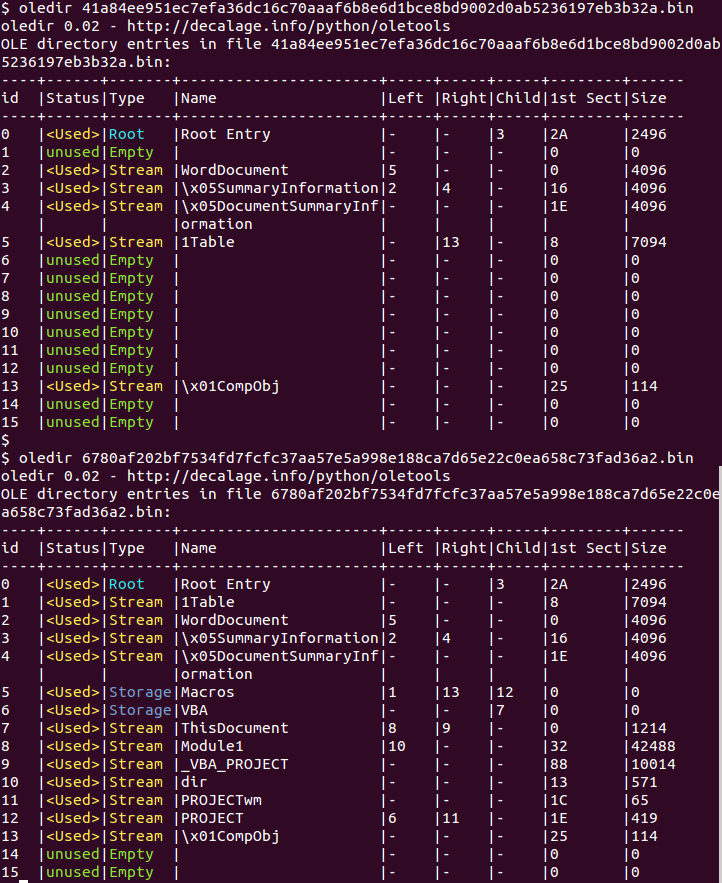

oledir
======

oledir is a script to display all the directory entries of an OLE file,
including free and orphaned entries.

It can be used either as a command-line tool, or as a python module from your own applications.

It is part of the [python-oletools](http://www.decalage.info/python/oletools) package.

## Usage

```text
Usage: oledir [options] <filename> [filename2 ...]

Options:
  -h, --help            show this help message and exit
  -r                    find files recursively in subdirectories.
  -z ZIP_PASSWORD, --zip=ZIP_PASSWORD
                        if the file is a zip archive, open all files from it,
                        using the provided password (requires Python 2.6+)
  -f ZIP_FNAME, --zipfname=ZIP_FNAME
                        if the file is a zip archive, file(s) to be opened
                        within the zip. Wildcards * and ? are supported.
                        (default:*)
```

### Examples

Scan a single file:

```text
oledir file.doc
```
    



--------------------------------------------------------------------------
    
## How to use oledir in Python applications

TODO

--------------------------------------------------------------------------

python-oletools documentation
-----------------------------

- [[Home]]
- [[License]]
- [[Install]]
- [[Contribute]], Suggest Improvements or Report Issues
- Tools:
	- [[mraptor]]
	- [[msodde]]
	- [[olebrowse]]
	- [[oledir]]
	- [[oleid]]
	- [[olemap]]
	- [[olemeta]]
	- [[oleobj]]
	- [[oletimes]]
	- [[olevba]]
	- [[pyxswf]]
	- [[rtfobj]]
